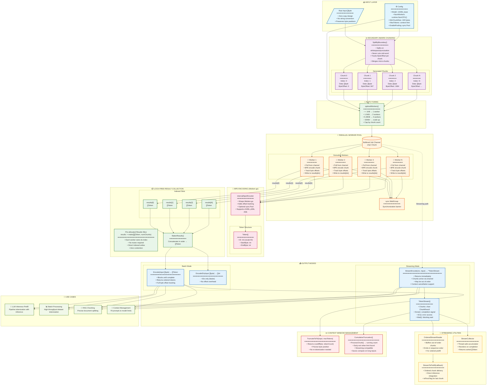

# go-fast-token

[](https://pkg.go.dev/github.com/kraghavan/go-fast-token)
[](https://goreportcard.com/report/github.com/kraghavan/go-fast-token)
[](https://opensource.org/licenses/MIT)

Fast, parallel tokenizer for LLM inference pipelines in Go.

## Features

- 🚀 **Parallel Chunked Tokenization** — Splits input at natural boundaries and processes chunks concurrently
- 📡 **Streaming Interface** — Start prefill while tokenization continues (pipelined execution)
- 📍 **Byte Offset Tracking** — Map tokens back to source text for precise truncation
- ✂️ **Context Window Management** — Truncate to exact token count without re-tokenization
- 🔧 **Zero-Copy Design** — Uses `[]byte` throughout to minimize allocations
- ⚡ **Indexed Parallelism** — Lock-free result collection via pre-allocated slices
- 🎯 **Auto-Tuned Workers** — Dynamically selects optimal worker count based on input size


## Installation

```bash
go get github.com/kraghavan/go-fast-token
```

## Quick Start

```go
package main

import (
    "fmt"
    "log"

    tokenizer "github.com/kraghavan/go-fast-token"
)

func main() {
    // Create tokenizer (defaults to cl100k_base / GPT-4)
    tok, err := tokenizer.New(tokenizer.DefaultConfig())
    if err != nil {
        log.Fatal(err)
    }

    text := []byte("Hello, world! This is a test.")

    // Encode with byte offsets
    tokens, _ := tok.Encode(text)
    fmt.Printf("Tokens: %d\n", len(tokens))

    // Show token-to-source mapping
    for _, t := range tokens {
        fmt.Printf("  ID=%d -> %q\n", t.ID, text[t.StartByte:t.EndByte])
    }
}
```

## Streaming for Inference Pipelines

The streaming interface enables pipelining tokenization with inference prefill:

```go
ctx := context.Background()
stream := tok.StreamEncode(ctx, largePrompt)

// Process chunks as they complete (may arrive out of order)
for chunk := range stream.Chunks {
    // Send to inference engine immediately
    inferenceEngine.PrefillChunk(chunk.Tokens)
}
```

For ordered processing:

```go
ordered := tokenizer.NewOrderedStreamReader(stream)
for chunk := range ordered.Results() {
    // Chunks arrive in original order
    processInOrder(chunk.Tokens)
}
```

## Context Window Truncation

Efficiently truncate to fit context limits:

```go
// Find byte position to cut input to exactly 4096 tokens
cutoffByte, tokenCount, err := tok.TruncateToFit(input, 4096)
truncated := input[:cutoffByte]
```

For streaming truncation (stops early when limit is found):

```go
truncator := tokenizer.NewCumulativeTruncation(4096)
for chunk := range stream.Chunks {
    if found, cutoff := truncator.ProcessChunk(chunk); found {
        cancel() // Stop processing remaining chunks
        break
    }
}
```

## Configuration

```go
cfg := tokenizer.Config{
    Model:        "cl100k_base", // or "gpt-4", "gpt-3.5-turbo", "p50k_base"
    NumWorkers:   8,             // Max parallel workers (auto-tuned per request)
    MinChunkSize: 100,           // Minimum bytes per chunk
    MaxTokens:    4096,          // Auto-truncate (0 = disabled)
    EnablePooling: true,         // sync.Pool for high throughput
}
tok, _ := tokenizer.New(cfg)
```

> **Note:** `NumWorkers` sets the maximum — the tokenizer automatically selects fewer workers for smaller inputs to avoid coordination overhead.

## Supported Models

| Model | Encoding | Used By |
|-------|----------|---------|
| `o200k_base` | BPE | GPT-4o, GPT-4o-mini, o1, o3, o4-mini |
| `cl100k_base` | BPE | GPT-4, GPT-4-turbo, GPT-3.5-turbo, text-embedding-ada-002 |
| `p50k_base` | BPE | Codex, text-davinci-002/003 |
| `r50k_base` | BPE | GPT-3 (davinci, curie, etc.) |
```go
// GPT-4o (recommended for new projects)
cfg := tokenizer.DefaultConfig()
cfg.Model = "o200k_base"
tok, _ := tokenizer.New(cfg)

// Or use model name directly
tok, _ := tokenizer.NewWithModel("gpt-4o")

## Architecture

```
┌─────────────────────────────────────────────────────────┐
│                     Input []byte                        │
└─────────────────────────────────────────────────────────┘
                          │
                          ▼
┌─────────────────────────────────────────────────────────┐
│  Boundary Splitter (whitespace/punctuation)             │
│  → []Chunk with Index + ByteOffset                      │
└─────────────────────────────────────────────────────────┘
                          │
                          ▼
┌─────────────────────────────────────────────────────────┐
│  Auto-Tune: optimalWorkers(inputSize, numChunks, max)   │
│  → Select 1-N workers based on workload                 │
└─────────────────────────────────────────────────────────┘
                          │
          ┌───────────────┼───────────────┐
          ▼               ▼               ▼
     ┌─────────┐     ┌─────────┐     ┌─────────┐
     │Worker 1 │     │Worker 2 │     │Worker N │
     │  BPE    │     │  BPE    │     │  BPE    │
     └─────────┘     └─────────┘     └─────────┘
          │               │               │
          ▼               ▼               ▼
┌─────────────────────────────────────────────────────────┐
│  Pre-allocated Results Slice (indexed writes, no locks) │
└─────────────────────────────────────────────────────────┘
                          │
                          ▼
┌─────────────────────────────────────────────────────────┐
│  Flatten → []Token with byte offsets                    │
└─────────────────────────────────────────────────────────┘
```

<details>
<summary>Click to expand full architecture diagram</summary>



</details>

## Benchmarks

Run benchmarks:

```bash
cd bench
go test -bench=. -benchmem
```

Results (Apple M4, 10 cores):

| Benchmark | Input Size | Time | Throughput |
|-----------|------------|------|------------|
| Encode_Small | 100 B | 11 µs | — |
| Encode_Medium | 1 KB | 126 µs | — |
| Encode_Large | 10 KB | 814 µs | — |
| Encode_VeryLarge | 100 KB | 11 ms | — |
| **Throughput** | 10 KB | 753 µs | **3.04M tokens/sec** |

### Auto-Tuning Impact

With auto-tuning, worker count is dynamically selected based on input size:

| Input Size | Workers Selected | Rationale |
|------------|------------------|-----------|
| < 1 KB | 1 | Parallelism overhead exceeds benefit |
| 1-5 KB | 2 | Light parallelism |
| 5-20 KB | 4 | Sweet spot |
| 20 KB+ | Scales up | More chunks = more workers |

### Before vs After Auto-Tuning

| Config | Before (fixed 8 workers) | After (auto-tuned) | Improvement |
|--------|--------------------------|---------------------|-------------|
| 10 KB input | 1,012 µs | 778 µs | **23% faster** |
| Throughput | 2.09M tok/s | 3.04M tok/s | **45% faster** |

> **Why?** Profiling with `GOGC=off` proved the slowdown was coordination overhead, not GC. Auto-tuning eliminates unnecessary goroutine scheduling.

## API Reference

### Tokenizer Interface

```go
type Tokenizer interface {
    // Encode with byte offset tracking
    Encode(input []byte) ([]Token, error)
    
    // Encode returning only IDs (faster when offsets not needed)
    EncodeIDs(input []byte) ([]int, error)
    
    // Streaming encode for pipeline integration
    StreamEncode(ctx context.Context, input []byte) *TokenStream
    
    // Decode IDs back to bytes
    Decode(ids []int) ([]byte, error)
    
    // Find truncation point for context window
    TruncateToFit(input []byte, maxTokens int) (cutoffByte, tokenCount int, err error)
    
    // Fast token counting
    CountTokens(input []byte) (int, error)
}
```

### Token Type

```go
type Token struct {
    ID        int // Vocabulary ID
    StartByte int // Start position in input
    EndByte   int // End position (exclusive)
}
```

## Performance Tips

1. **Use `[]byte` input** — Avoids string-to-byte conversions
2. **Trust auto-tuning** — Worker count adjusts automatically per request
3. **Use `CountTokens`** — Faster than `len(Encode())` when offsets aren't needed
4. **Enable pooling for high throughput** — `cfg.EnablePooling = true` reduces GC pressure
5. **Stream for large inputs** — Pipelining hides tokenization latency
6. **Profile before optimizing** — Run `GOGC=off` tests to isolate GC vs coordination overhead

## Contributing

Contributions welcome! Please open an issue first to discuss proposed changes.

## License

MIT License - see [LICENSE](LICENSE) for details.

## Credits

Built on top of [tiktoken-go](https://github.com/pkoukk/tiktoken-go) for BPE encoding.

